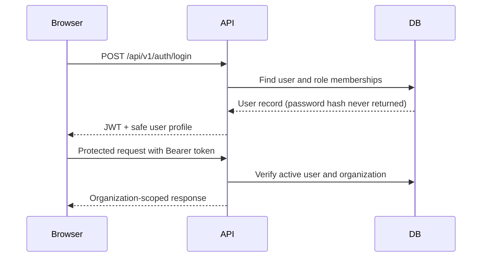
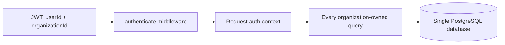

# SupplyQuest DZ — Architecture

## Scope

This document describes the modular monolith currently implemented for SupplyQuest DZ. `docs/PRODUCT_SPEC.md` remains the canonical product source of truth.

## Technology

- React + TypeScript + Vite + Tailwind CSS
- Node.js + Express + TypeScript
- PostgreSQL + Prisma ORM
- Zod at API boundaries
- bcryptjs password hashing and JWT bearer authentication
- Vitest + Supertest for API tests

The application is a modular monolith. A single process serves the Express API and Vite frontend in development. This keeps local development simple while the module boundaries leave room for future service extraction.

## Folder structure

```text
backend/src/
  app.ts                         Express middleware and route composition
  server.ts                      HTTP server and Vite/static integration
  middleware/                    Authentication, RBAC, validation, errors
  modules/auth/                  Registration, login, logout, current-user
  modules/foundation/            Tenant-scoped foundation demonstration endpoints
  modules/intelligence/          Explainable inventory analytics and operational signals
  db/                            Prisma client
frontend/src/
  components/                    App shell and reusable UI primitives
  context/                       Authentication state
  lib/                           API client, locale, formatting utilities
  pages/                         Login, registration, operations and intelligence screens
prisma/
  schema.prisma                  Relational schema and tenant-safe workflow state
  seed.ts                        Repeatable synthetic Algerian-oriented demo data
tests/                           API integration tests
```

## Authentication and authorization

Registration creates an organization and its first `ADMIN` user in one database transaction. Passwords are hashed with bcrypt. Login returns a short-lived JWT containing only the user and organization identifiers. The `authenticate` middleware verifies the token, re-reads the user from PostgreSQL, and attaches a minimal auth context to the request. Logout is stateless: the client removes its token and the endpoint confirms the action.

`authorize(...roles)` is reusable route middleware. The `/api/v1/foundation/admin-check` endpoint demonstrates a role-protected route without introducing a permissions-management UI.



## Multi-tenancy

Every user belongs to exactly one organization. Organization-owned foundation tables carry `organization_id`, and service queries require the authenticated organization ID. Cross-organization resource lookup uses both the resource ID and `organization_id`, returning the same not-found response as an unknown resource. This makes tenant isolation a server-side property rather than a frontend filtering convention.



## Database strategy

V1 uses one managed PostgreSQL database and Prisma migrations. The schema includes the foundation catalog plus inventory, purchasing, sales, transfers, replenishment recommendations, and inventory alerts. All IDs are UUIDs, timestamps use `created_at`/`updated_at`, and product prices and persisted intelligence snapshots use PostgreSQL `NUMERIC` through Prisma Decimal. Derived health metrics remain dynamic; recommendation and alert status are persisted because users act on and resolve those records.

## API conventions

Routes are versioned under `/api/v1/`. Successful responses use `{ success: true, data }`; errors use `{ success: false, error: { code, message } }`. Zod validates request bodies, controllers remain thin, and centralized error handling prevents stack traces from reaching normal API responses.

Implemented endpoints:

| Method | Path | Purpose |
| --- | --- | --- |
| GET | `/api/v1/health` | Service health |
| POST | `/api/v1/auth/register` | Create organization + initial admin |
| POST | `/api/v1/auth/login` | Authenticate |
| POST | `/api/v1/auth/logout` | Confirm stateless client logout |
| GET | `/api/v1/auth/me` | Current authenticated user |
| GET | `/api/v1/foundation/summary` | Tenant-scoped foundation counts |
| GET | `/api/v1/foundation/admin-check` | ADMIN-only authorization demonstration |
| GET | `/api/v1/foundation/warehouses/:id` | Tenant-scoped resource lookup used by the isolation contract |

## Localization and Algerian context

The frontend has an English, French, and Arabic translation structure. Changing to Arabic updates `lang` and `dir="rtl"` on the document. DZD, date, and number formatting utilities plus a structured starter list of wilayas are ready for later feature modules. Only the foundation shell is translated in Phase 0.

## Phase 2 intelligence

The intelligence module reads organization-scoped inventory levels, immutable inventory transactions, purchase orders, receiving transactions, and completed sales transactions. Controllers only select the authenticated organization and delegate to `intelligence.service.ts`; no analytics values are hard-coded in React.

### Metric methodology

- **Inventory value:** `on_hand_quantity × product.purchase_price`. FIFO, LIFO, and weighted-average valuation are intentionally deferred.
- **Demand:** completed `SALE` inventory transactions in the selected period. Average daily demand is total units divided by period days; recent demand is the trailing 14 days compared with the preceding 14-day baseline. Volatility is the standard deviation of daily units.
- **Days of inventory:** `available_quantity ÷ average_daily_demand`, where available is on-hand less reserved. Zero demand is represented as null rather than infinity.
- **Health thresholds:** `CRITICAL` is zero-to-seven days, `LOW` is eight-to-thirty, `HEALTHY` is thirty-one-to-ninety, and `EXCESS` is over ninety. Products without enough history are marked `INSUFFICIENT`.
- **Stockout risk:** a 0–100 rule score adds exposure for low coverage, coverage shorter than supplier lead time, stock at/below safety stock, and a positive recent demand trend. Levels are LOW (0–24), MEDIUM (25–49), HIGH (50–74), and CRITICAL (75–100). It is a business-rule signal, not machine learning.
- **Overstock and slow movement:** overstock compares coverage to a 30-day target and scales excess coverage to 0–100. Slow movement uses daily demand: FAST is at least 5 units/day, NORMAL is 0.25–5, SLOW is below 0.25, and DEAD is no sales in a sufficient analysis window.
- **Aging:** the existing transaction model has no lots or batches. Aging is a weighted approximation using inbound transaction quantities and age, shown in 0–30, 31–60, 61–90, and 90+ day buckets.
- **Turnover:** sales consumption divided by a current-inventory proxy (`current on hand + half of period sales`). This is an operational ratio, not a financial accounting valuation.
- **ABC:** products are sorted by revenue (`sold units × selling price`) in the selected period. A is the first 80% of cumulative contribution, B the next 15%, and C the remaining 5%.
- **Supplier score:** on-time rate (60%), delay penalty (25%), and fill rate (15%), using purchase-order and receipt history. Suppliers with no completed receiving history remain unscored.
- **Reorder point:** `average daily demand × supplier lead time + safety stock`. A recommendation target adds 14 days of review-period demand; recommended quantity is `max(0, target - available)`. Recommendations include all inputs and explanation.

Demand-derived values explicitly carry an insufficient-data state when the selected period or transaction history cannot support a reliable signal. Recommendations are not created without sufficient demand and lead-time data.

`ReplenishmentRecommendation` and `InventoryAlert` are the only Phase 2 derived entities. They are organization-scoped, indexed by tenant/status/entity, and use stable product/warehouse or condition fingerprints to prevent duplicate records when a condition is unchanged. Status changes are separate authenticated mutations.

Phase 2 endpoints are under `/api/v1/intelligence`: `overview`, `inventory-health`, `demand`, `stockout-risk`, `overstock`, `slow-moving`, `abc`, `suppliers`, `warehouses`, `reorder-points`, `recommendations`, `alerts`, and `products/:id`. Collection endpoints use server-side filters/pagination. No cache, queue, Redis, Python service, ML model, or advanced forecast is introduced.

## Future Python analytics

The API/domain boundaries leave a natural extension point for a later Python analytics service. Forecasting and recommendation calculations should consume explicit data contracts from the Node API rather than being embedded in React or Express route handlers. No Python service or analytics workflow is started in Phase 0.

## Deliberate non-decisions

Redis, queues, search infrastructure, GraphQL, microservices, and a second database are intentionally absent. They would add operational complexity before the core domain and tenant boundaries are proven. Phase 1 can add transactional models and workflows without changing the auth or organization model.