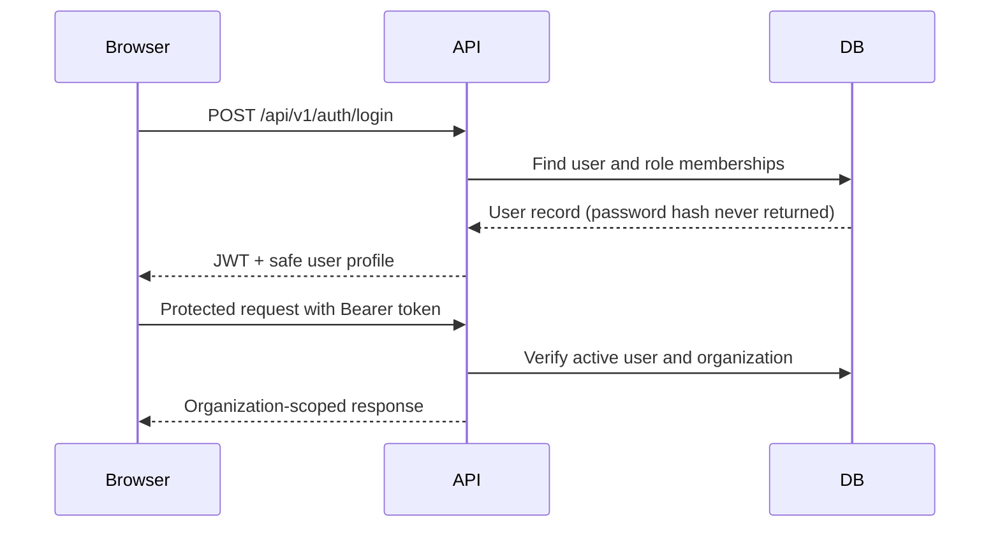
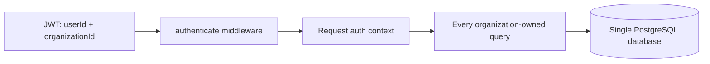

# SupplyQuest DZ — Phase 0 Architecture

## Scope

This document describes the foundation currently implemented for SupplyQuest DZ. `docs/PRODUCT_SPEC.md` remains the canonical product source of truth. Phase 1+ operational workflows are intentionally not implemented yet.

## Technology

- React + TypeScript + Vite + Tailwind CSS
- Node.js + Express + TypeScript
- PostgreSQL + Prisma ORM
- Zod at API boundaries
- bcryptjs password hashing and JWT bearer authentication
- Vitest + Supertest for API tests

The application is a modular monolith. A single process serves the Express API and Vite frontend in development. This keeps local development simple while the module boundaries leave room for future service extraction.

## Folder structure

```text
backend/src/
  app.ts                         Express middleware and route composition
  server.ts                      HTTP server and Vite/static integration
  middleware/                    Authentication, RBAC, validation, errors
  modules/auth/                  Registration, login, logout, current-user
  modules/foundation/            Tenant-scoped foundation demonstration endpoints
  db/                            Prisma client
frontend/src/
  components/                    App shell and reusable UI primitives
  context/                       Authentication state
  lib/                           API client, locale, formatting utilities
  pages/                         Login, registration, foundation dashboard
prisma/
  schema.prisma                  Phase 0 relational schema
  seed.ts                        Repeatable synthetic Algerian-oriented demo data
tests/                           API integration tests
```

## Authentication and authorization

Registration creates an organization and its first `ADMIN` user in one database transaction. Passwords are hashed with bcrypt. Login returns a short-lived JWT containing only the user and organization identifiers. The `authenticate` middleware verifies the token, re-reads the user from PostgreSQL, and attaches a minimal auth context to the request. Logout is stateless: the client removes its token and the endpoint confirms the action.

`authorize(...roles)` is reusable route middleware. The `/api/v1/foundation/admin-check` endpoint demonstrates a role-protected route without introducing a permissions-management UI.



## Multi-tenancy

Every user belongs to exactly one organization. Organization-owned foundation tables carry `organization_id`, and service queries require the authenticated organization ID. Cross-organization resource lookup uses both the resource ID and `organization_id`, returning the same not-found response as an unknown resource. This makes tenant isolation a server-side property rather than a frontend filtering convention.



## Database strategy

V1 uses one managed PostgreSQL database and Prisma migrations. The Phase 0 schema includes organizations, users, roles, user_roles, warehouses, product_categories, products, suppliers, and customers. All IDs are UUIDs, timestamps use `created_at`/`updated_at`, and product prices use PostgreSQL `NUMERIC` through Prisma Decimal. Transactional tables for purchasing, sales, inventory movements, and audit logs are deliberately deferred to later phases.

## API conventions

Routes are versioned under `/api/v1/`. Successful responses use `{ success: true, data }`; errors use `{ success: false, error: { code, message } }`. Zod validates request bodies, controllers remain thin, and centralized error handling prevents stack traces from reaching normal API responses.

Implemented endpoints:

| Method | Path | Purpose |
| --- | --- | --- |
| GET | `/api/v1/health` | Service health |
| POST | `/api/v1/auth/register` | Create organization + initial admin |
| POST | `/api/v1/auth/login` | Authenticate |
| POST | `/api/v1/auth/logout` | Confirm stateless client logout |
| GET | `/api/v1/auth/me` | Current authenticated user |
| GET | `/api/v1/foundation/summary` | Tenant-scoped foundation counts |
| GET | `/api/v1/foundation/admin-check` | ADMIN-only authorization demonstration |
| GET | `/api/v1/foundation/warehouses/:id` | Tenant-scoped resource lookup used by the isolation contract |

## Localization and Algerian context

The frontend has an English, French, and Arabic translation structure. Changing to Arabic updates `lang` and `dir="rtl"` on the document. DZD, date, and number formatting utilities plus a structured starter list of wilayas are ready for later feature modules. Only the foundation shell is translated in Phase 0.

## Future Python analytics

The API/domain boundaries leave a natural extension point for a later Python analytics service. Forecasting and recommendation calculations should consume explicit data contracts from the Node API rather than being embedded in React or Express route handlers. No Python service or analytics workflow is started in Phase 0.

## Deliberate non-decisions

Redis, queues, search infrastructure, GraphQL, microservices, and a second database are intentionally absent. They would add operational complexity before the core domain and tenant boundaries are proven. Phase 1 can add transactional models and workflows without changing the auth or organization model.